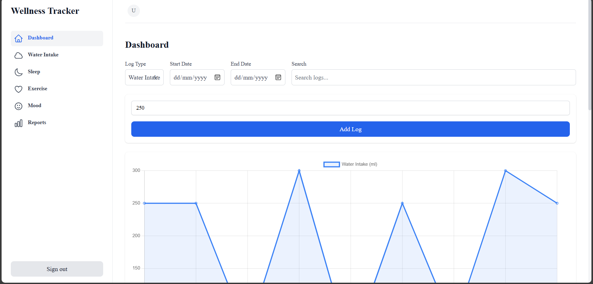
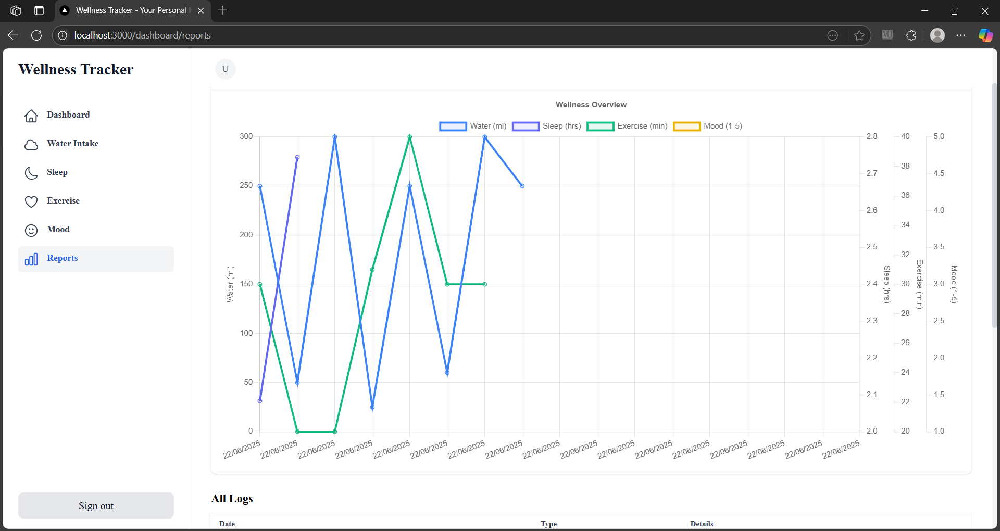

# Wellness Tracker

A modern, full-stack web application to help you track and improve your daily wellness habits: water intake, sleep, exercise, and mood.


## Features

- **User Registration & Authentication**
  - Secure sign up and login with email and password (NextAuth.js, MongoDB)
- **Personal Dashboard**
  - View and manage all your wellness logs in one place
  - Filter logs by type, date, and search text
  - Add, edit, and delete logs for water, sleep, exercise, and mood
- **Charts & Trends**
  - Visualize your progress with interactive charts (Chart.js)
  - See trends for each wellness type and an overall report
- **Reminders & Notifications**
  - In-app browser notifications for daily reminders (customizable)
  - Email reminder support (backend ready, see below)
- **Mobile Responsive & Accessible**
  - Clean, modern UI with Tailwind CSS
  - Works on all devices and is keyboard accessible

---

## Screenshots

### Dashboard


### Reports & Charts


---

## Getting Started

### 1. Clone the repository
```bash
git clone <your-repo-url>
cd wellness-tracker
```

### 2. Install dependencies
```bash
npm install
# or
yarn install
```

### 3. Set up environment variables
Create a `.env.local` file in the root:
```env
MONGODB_URI=your_mongodb_connection_string
NEXTAUTH_SECRET=your_nextauth_secret
NEXTAUTH_URL=http://localhost:3000
EMAIL_SERVER_USER=your_email_user (if using email reminders)
EMAIL_SERVER_PASSWORD=your_email_password
EMAIL_SERVER_HOST=your_email_host
EMAIL_SERVER_PORT=your_email_port
EMAIL_FROM=your_from_email
```

### 4. Run the development server
```bash
npm run dev
# or
yarn dev
```
Open [http://localhost:3000](http://localhost:3000) in your browser.

---

## Folder Structure

- `src/app/` - Next.js app directory
  - `dashboard/` - Dashboard and all wellness pages (water, sleep, exercise, mood, reports)
  - `api/` - API routes for authentication and wellness logs
  - `auth/` - Auth pages (sign in, sign up)
- `src/components/` - Reusable UI components (LogForm, LogEntry, etc.)
- `src/models/` - Mongoose models (User, WellnessLog)
- `src/lib/` - Database and utility functions (including reminders)
- `public/` - Static assets and images

---

## How Reminders & Notifications Work

### In-App Reminders (Browser Notifications)
- Browser notifications are scheduled using JavaScript timers and the Notification API.
- Default reminder times are set for each wellness type (see `src/lib/reminderService.js`).
- When the user visits the app, call `requestNotificationPermission()` and then `scheduleReminders()` to enable reminders.
- Example notification: “Time to drink some water! 💧”

### Email Reminders (Backend Ready)
- The backend is set up to send email reminders using `nodemailer`.
- Fill out the email settings in `.env.local`.
- You can add a cron job or serverless function to send emails at user-preferred times.

---

## Customization

- **Add more wellness types:** Extend the `WellnessLog` model and update the UI.
- **Change chart types:** Update Chart.js config in each dashboard page.
- **Add more notification options:** Extend `reminderService.js` or backend logic.
- **Add more filters/search:** UI and API are ready for further enhancements.

---

## License

MIT

---

## Credits
- Built with [Next.js](https://nextjs.org/), [Tailwind CSS](https://tailwindcss.com/), [MongoDB](https://www.mongodb.com/), [NextAuth.js](https://next-auth.js.org/), [Chart.js](https://www.chartjs.org/), [Heroicons](https://heroicons.com/)

---

